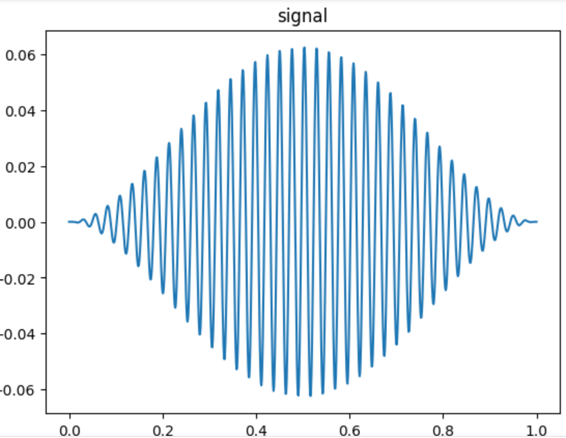
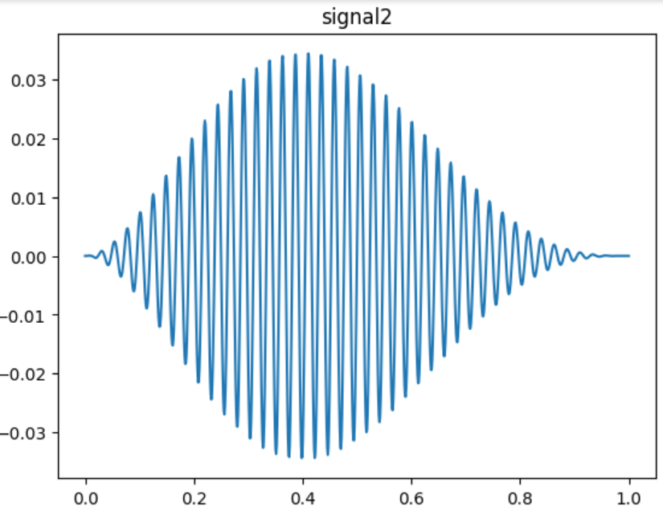
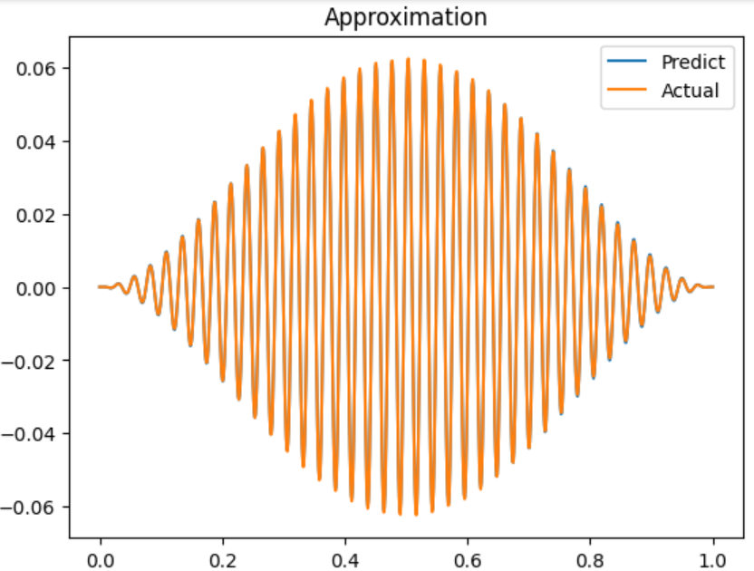
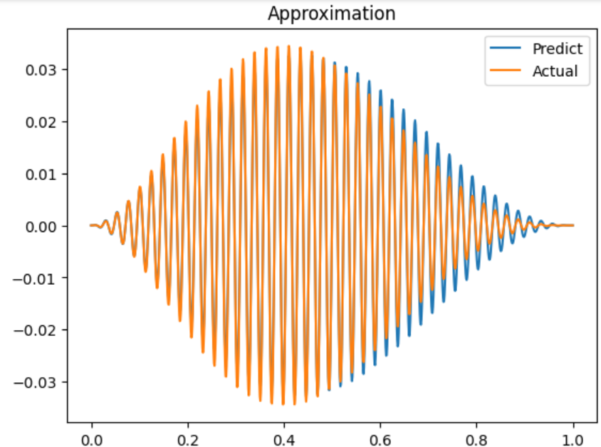

# About this repository

This repository is an optimization algorithm for the following problem:

Finding a function $f$ that minimizes the following expression:

$$ (f(x)-\text{signal})^2 $$

Where $\text{signal}$ is the signal from a flow detector in canalisations.

Moreover $f$ is characterized by the following expression:

$$ f(x) = cx^a(1-x)^b \cos (2\pi \nu x - \phi) $$

Where $c$, $a$, $b$, $\nu$ and $\phi$ are the parameters to be optimized.

Two signals are provided in the file `signal.csv` and `signal2.csv`. Two graphical representations of the signals are shown below:

[](signal1)

[](signal2)

For this problem, an Adam optimizer is used to minimize the expression. The algorithm is implemented in the file `main.py`.

The results of the optimization are shown below:

[](result1)

[](result2)

# How to reproduce the results

To reproduce the results, you can run the file `main.py` with the following command:

```bash
python main.py
```

You have to install python on your machine to run this command.

# Requirements

The requirements for this repository are shown in the file `requirements.txt`. You can install them with the following command:

```bash
pip install -r requirements.txt
```

# Bibliography

This project is inspired by V.Vigon teaching at the University of Strasbourg. The course is available at the following address: [https://colab.research.google.com/drive/1Fabl0nLbM5FdXWkIFKH0KRy46BwexvYa](https://colab.research.google.com/drive/1Fabl0nLbM5FdXWkIFKH0KRy46BwexvYa)